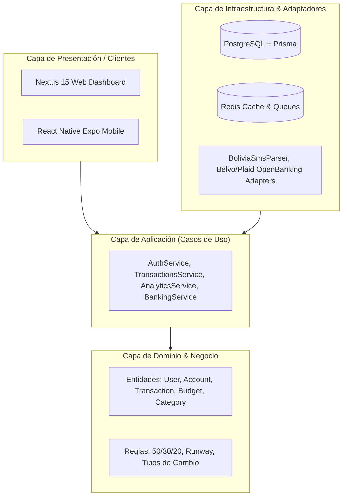

# 🏛️ Documento de Arquitectura de Software & Buenas Prácticas

## 1. Visión y Principios Rectores

Finanzapp está construida siguiendo los principios de **Clean Architecture**, **Domain-Driven Design (DDD)** y separación estricta de responsabilidades:

1. **Independencia de Frameworks:** La lógica de negocio central (cálculos de patrimonio, clasificación 50/30/20, conversiones de moneda) no depende de bibliotecas externas.
2. **Consistencia Transaccional (ACID):** El balance de las cuentas nunca se modifica mediante operaciones sueltas; toda transacción financiera y su impacto en saldos se ejecuta dentro de transacciones de base de datos (`$transaction`).
3. **End-to-End Type Safety:** Todos los contratos de datos (DTOs, Enums y modelos de dominio) residen en `@finanzapp/shared-types`, garantizando consistencia total entre Backend, Web y Móvil.

---

## 2. Convenciones de Código y Estructura

### Backend (NestJS):
* **Módulos Feature-First:** Cada área de negocio (`accounts`, `transactions`, `budgets`, `banking`) es un módulo autocontenido con su Controller, Service y DTOs.
* **Validación Declarativa:** Uso de `ValidationPipe` global con Zod y Class-Validator para rechazar cualquier payload malicioso antes de llegar al servicio.
* **Manejo Centralizado de Errores:** `AllExceptionsFilter` captura y estandariza todas las respuestas HTTP (`statusCode`, `timestamp`, `error`).

### Frontend (Next.js & Expo Mobile):
* **Componentes Atómicos:** Separación entre componentes de presentación pura y componentes con estado.
* **Dark Mode Nativo:** Soporte integrado para tema oscuro y claro mediante Tailwind CSS.
* **Accesibilidad:** Uso de iconos semánticos y contrastes WCAG AA.

---

## 3. Seguridad Grado Fintech

1. **Cifrado de Contraseñas:** `bcrypt` con factor de coste de 10 rondas.
2. **Autenticación con JWT & Refresh Tokens:** Tokens de acceso con expiración corta y tokens de refresco seguros.
3. **Protección contra Inyecciones:** Consultas preparadas garantizadas por **Prisma ORM**.
4. **Idempotencia de Transacciones:** Prevención de duplicados mediante identificadores de transacción y auditoría en `AuditLog`.
