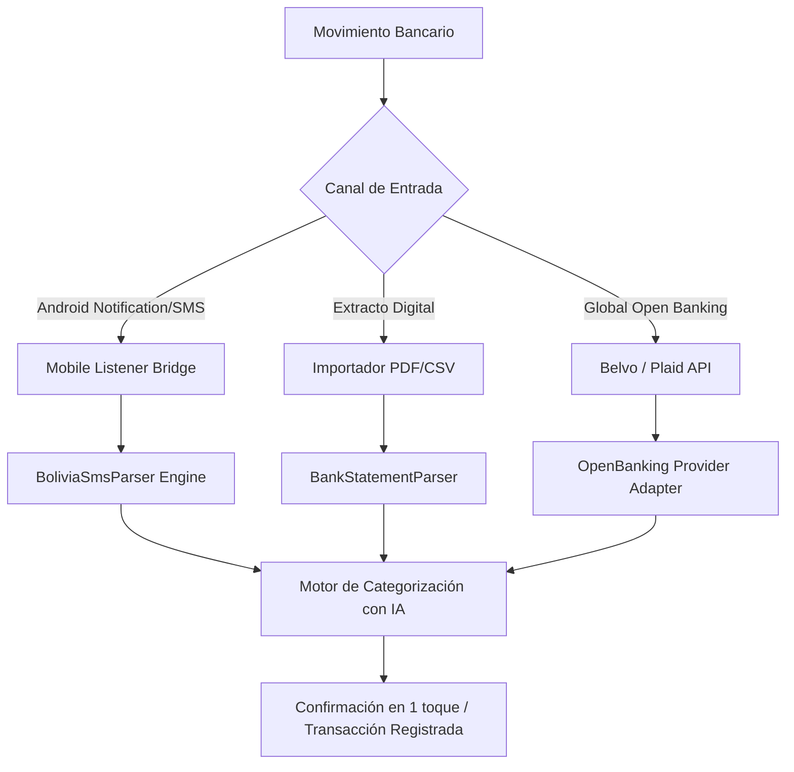

# 💳 Guía de Integración Bancaria: Bolivia & Escala Global

Este documento detalla la estrategia de captura y sincronización automática de transacciones financieras en **Finanzapp**, adaptada a la realidad boliviana y preparada para agregadores de Open Banking a nivel internacional.

---

## 1. Contexto en Bolivia

En Bolivia, la **ASFI** y los bancos (BCP, BNB, Banco Unión, Banco Bisa, Banco Mercantil Santa Cruz, etc.) cuentan con APIs para comercios (OpenBCB, Cobros QR Simple, pasarelas de pago), pero aún no disponen de una norma abierta de **Open Banking** que permita a una aplicación de terceros leer directamente los extractos de cuentas corrientes o de ahorro de una persona natural.

### Solución Implementada: Captura Inteligente de Tres Vías



### 1.1 Expresiones Regulares de Detección (BoliviaSmsParser)

El módulo `BoliviaSmsParser` implementa patrones de alta precisión para los principales emisores bancarios:

| Entidad | Formato de Mensaje Típico | Datos Extraídos |
| :--- | :--- | :--- |
| **Banco BCP** | `BCP: Compra con tarjeta ****4431 por Bs. 245.50 en Hipermaxi el 28/08/2026.` | Monto: `245.50`, Moneda: `BOB`, Tarjeta: `****4431`, Comercio: `Hipermaxi` |
| **BNB** | `BNB: Compra de Bs 85.00 en CAFE TYPICA. Saldo Disp: Bs 2500` | Monto: `85.00`, Moneda: `BOB`, Comercio: `CAFE TYPICA` |
| **Banco Unión** | `B.Union: Compra de Bs. 200.00 en FARMACORP CALA CALA.` | Monto: `200.00`, Moneda: `BOB`, Comercio: `FARMACORP` |
| **Banco BISA** | `BISA Notifica: Consumo tarjeta por Bs 320.00 en SURTIDOR AMERICA.` | Monto: `320.00`, Moneda: `BOB`, Comercio: `SURTIDOR AMERICA` |
| **BMSC** | `BMSC: Pago con QR de Bs 45.00 a POLLOS KINGDOM.` | Monto: `45.00`, Moneda: `BOB`, Comercio: `POLLOS KINGDOM` |
| **QR Simple Interoperable** | `Pago QR Simple realizado con exito por Bs 65.50 a Farmacia Chavez.` | Monto: `65.50`, Moneda: `BOB`, Comercio: `Farmacia Chavez` |

---

## 2. Escalabilidad Internacional (Open Banking Adapters)

Para expandir la aplicación a otros países, se utiliza el patrón **Adapter**:

```typescript
export interface OpenBankingProviderAdapter {
  connect(credentials: any): Promise<BankConnectionResult>;
  fetchAccounts(connectionId: string): Promise<AccountModel[]>;
  syncTransactions(connectionId: string, sinceDate: Date): Promise<ParsedBankTransaction[]>;
}
```

* **Latinoamérica (México, Colombia, Brasil, Chile, Perú):** Integración con **Belvo** y **Prometeo OpenBanking**.
* **EE.UU. y Canadá:** Integración con **Plaid** y **Teller.io**.
* **Europa / Reino Unido:** Integración con **GoCardless (Nordigen)** bajo directiva PSD2.
